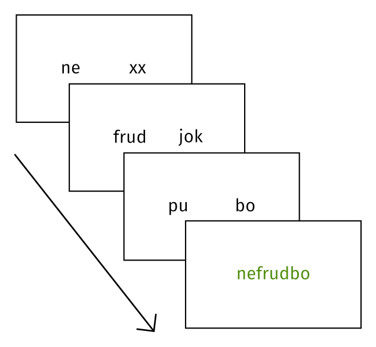

# The pseudo-maze task for statistical learning: Code for jsPsych 7


## The pseudo-maze task

In Chapter 5 of my PhD thesis, I adapted the classic psycholinguistic maze task into a paradigm that can be used for statistical learning.
This repository contains a minimal working example of the code I used.
The code draws heavily on the excellent [maze task plugin written by James Brand](https://github.com/jamesbrandscience/maze-jspsych).




## How to use

Give the pseudo-maze a try by opening [`index.html`](index.html) in a browser.

The experiment code can be found in [`exp.js`](exp.js).


## Citation

If you use this code, you can cite this repository:

```
@misc{Pankratz_Pseudo-maze_2024,
  author = {Pankratz, Elizabeth},
  title = {{The pseudo-maze task for statistical learning: Code for jsPsych 7}},
  url = {https://github.com/elizabethpankratz/pseudo-maze-jspsych},
  year = {2024}
}
```